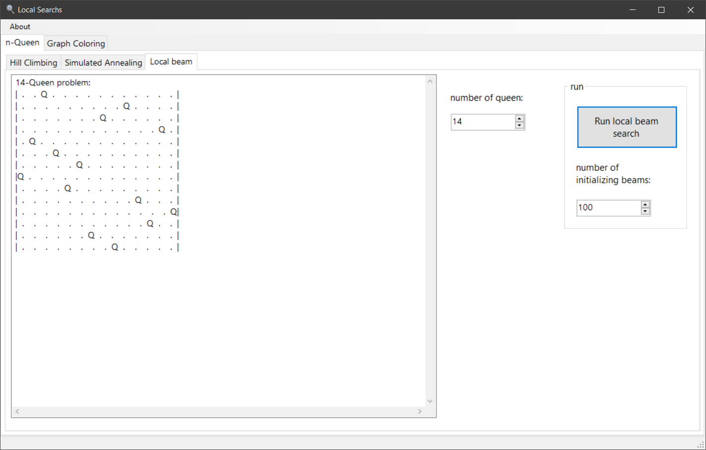

# local-searches
Artificial Intelligence local searches implementation and visualization in C#

## Searches:
Hill Climbing (best choise, first choise), Similuated Annealing, Local beam   

## Problems:  
n-Queen, Graph Coloring  
  

